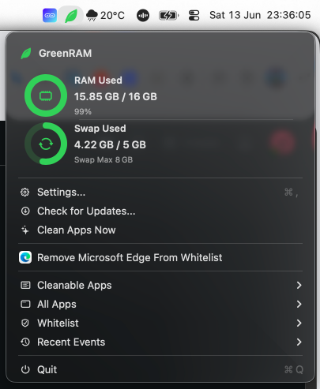
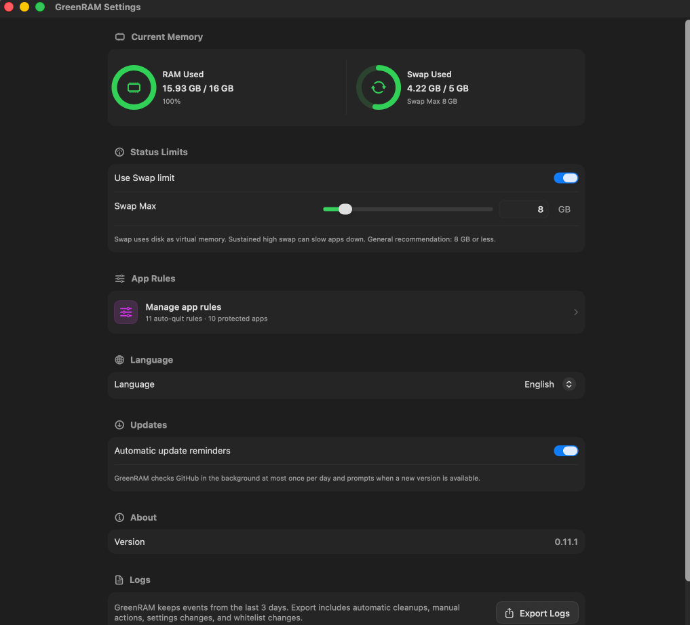

# GreenRAM

[中文说明](README.zh-CN.md) | [Changelog](CHANGELOG.md)

GreenRAM is a macOS menu bar app that watches system memory and asks long-idle background apps to quit under clear rules.

It is built for a simple case: keep the frontmost app responsive, remove background apps that should be gone, and leave protected apps alone.

## Screenshots

### Menu



### Settings



## Features

- At-a-glance menu bar health status with a green, orange, or red leaf for healthy, warning, and critical memory conditions.
- RAM status display and a configurable Swap limit.
- Auto-Quit Apps quit by non-frontmost time only.
- Ordinary non-whitelisted apps quit after their non-frontmost timeout plus either a system memory gate or their own app memory limit.
- Manual "Quit Eligible Apps Now" action.
- Editable whitelist support for apps that should not be quit.
- Multi-process memory accounting for browsers, Electron apps, Xcode helpers, and similar app trees.
- Localized UI for Simplified Chinese, Traditional Chinese, English, Japanese, German, and French.

## Supported macOS Versions and Architectures

- macOS 13.0 Ventura or later, including macOS 14 Sonoma and macOS 15 Sequoia.
- Release packages are Universal 2 and support both Apple Silicon (`arm64`) and Intel (`x86_64`) Macs.
- Local SwiftPM builds use the current Mac architecture unless you explicitly build a Universal 2 binary.

## Current Cleanup Policy

GreenRAM uses three rule groups:

- Whitelist: if an app is still in the whitelist, it is never quit. Finder, Dock, WindowServer, System Settings, and System Preferences are included by default, but they are only initial entries; every whitelist item can be removed, re-added, or edited in Settings.
- Auto-Quit Apps: for small utilities you open and leave. They only check non-frontmost time. Once that app's background-time threshold is reached, GreenRAM requests that it quit. RAM, Swap, and memory pressure do not participate.
- Ordinary apps: apps outside both the whitelist and the Auto-Quit Apps list. GreenRAM requests that they quit only when their non-frontmost time threshold has passed and either macOS reports memory pressure, system memory is over the configured limit, or that app exceeds its own memory limit.

For ordinary apps, the memory gate can be system-level or app-level. System-level means RAM reaches its built-in threshold, or the enabled Swap limit is reached. App-level means a Bundle ID has its own memory limit and the app's memory reaches it.

Non-frontmost time starts when an app leaves the foreground. The default threshold is 30 minutes. It can be changed in Settings, with a minimum of 3 minutes. Any app can have a custom app timeout; apps without one use the global default.

Protected apps cannot be added to Auto-Quit Apps, App Timeouts, or App Memory Limits. Remove an app from the whitelist before adding other rules. Adding an app to the whitelist removes it from Auto-Quit Apps; custom app timeouts and memory limits are preserved but do not affect the app while it is protected.

GreenRAM itself, the current frontmost app, and processes without a Bundle ID never enter the cleanup list.

App type, Bundle ID keywords, and app-name keywords do not decide whether an app is cleanable.

When multiple apps are cleanable, GreenRAM handles the apps that have stayed in the background longest first. Per-app memory is also used as a tie-breaker and for display.

Each automatic sweep asks at most 3 eligible apps to quit by default. Automatic sweeps have a 60-second cooldown, and the same Bundle ID is not requested again for 10 minutes after a successful quit request. Manual "Quit Eligible Apps Now" uses the same eligibility criteria.

## Never Quit Rules

GreenRAM never quits:

- GreenRAM itself
- the frontmost app
- whitelisted apps
- background apps that have not reached the configured background-time threshold
- ordinary apps while system memory is below the ordinary-app cleanup limit and the app is below its own memory limit

Whitelist protection also blocks rule assignment: a whitelisted app must be removed from Protected Apps before it can be added to Auto-Quit Apps, App Timeouts, or App Memory Limits.

## Download

Personal-use builds are available from the [Releases](../../releases) page. The v0.13.0 Universal 2 archive supports Apple Silicon and Intel Macs.

The current personal-use archive is ad-hoc signed and is not Apple-notarized. After copying `GreenRAM.app` to `/Applications`, first launch may require:

```sh
xattr -dr com.apple.quarantine /Applications/GreenRAM.app
```

A future public distribution and automatic updates should use Developer ID signing and Apple notarization.

## Build

```sh
swift build -c release
```

Run locally:

```sh
swift run GreenRAM
```
